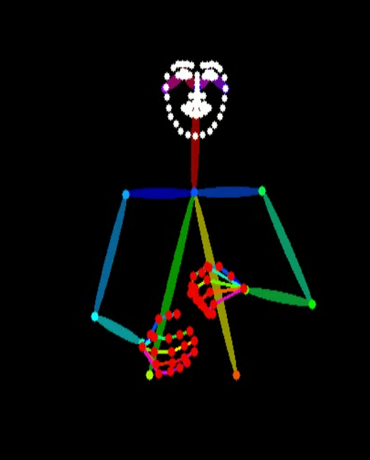

# Pose Normalization Pipeline using DWPose

## 📌 Overview

This project implements an end-to-end pipeline for extracting and normalizing human pose keypoints from videos using DWPose.

The system processes raw videos and generates standardized pose representations, making them suitable for downstream tasks such as animation, action recognition, and motion analysis.

---

## 🚀 Features

* Pose extraction using DWPose
* Shoulder-based pose normalization
* Confidence-based filtering of noisy keypoints
* Structured output in JSON and NumPy formats
* Skeleton visualization video generation
* Consistent pose alignment across different videos

---

## 🧠 Pipeline

Video → Pose Extraction → Normalization → Structured Output → Visualization

---

## 📂 Project Structure

pose-normalization-pipeline/
│
├── pipeline.py
├── requirements.txt
├── README.md
│
├── input_videos/
├── output_results/
├── assets/

---

## ⚙️ Installation

```bash
git clone https://github.com/<your-username>/pose-normalization-pipeline.git
cd pose-normalization-pipeline
pip install -r requirements.txt
```

---

## ▶️ Usage

### Step 1: Add input videos

Place your `.mp4` videos inside:

```
input_videos/
```

### Step 2: Run the pipeline

```bash
python pipeline.py
```

### Step 3: Check outputs

Results will be saved in:

```
output_results/
```

---

## 📊 Output

For each input video, the pipeline generates:

* 🎥 Normalized skeleton video (`.mp4`)
* 📁 Keypoints data (`.npy`)
* 📁 Confidence scores (`.npy`)
* 📄 Structured pose data (`.json`)

---

## 💡 Key Idea

The core idea of this project is pose normalization using shoulder alignment:

* The midpoint of shoulders is used for centering
* Distance between shoulders is used for scaling
* This ensures consistent pose representation across different camera angles and subjects

---

## 🔍 Technical Highlights

* Uses full-body keypoints (body, hands, face)
* Maintains compatibility with DWPose output format
* Applies confidence thresholding to reduce noise
* Crops upper body for consistent framing

---

## 📷 Output Example



---

## 🔥 Future Improvements

* Temporal smoothing for stable pose sequences
* Multi-person pose tracking
* Real-time processing
* 3D pose estimation

---

## 🙌 Acknowledgment

This project is built using the open-source implementation of DWPose by IDEA Research.

---
